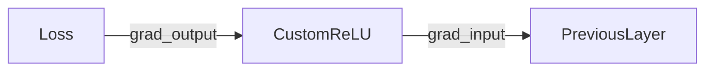

# 深入理解 PyTorch 自动微分：实现自定义 ReLU 函数

本文将通过实现一个自定义的 ReLU 函数，详细解析 PyTorch 中自动微分（autograd）的核心机制。我们将重点关注前向传播、反向传播以及上下文对象（context）的作用，并通过代码示例演示其工作原理。

---

## 为什么需要自定义 autograd 函数？

PyTorch 虽然提供了丰富的内置运算符，但在以下场景中需要自定义实现：
1. **理解底层机制**：掌握自动微分的实现细节
2. **性能优化**：针对特定硬件定制计算逻辑
3. **实现特殊运算符**：处理框架未内置的数学操作

## 实现框架解析

### 1. 继承 `torch.autograd.Function`
所有自定义的 autograd 函数都需要继承该基类，并实现两个静态方法：
```python
class CustomReLU(torch.autograd.Function):
    @staticmethod
    def forward(ctx, input):
        # 前向传播逻辑
    
    @staticmethod
    def backward(ctx, grad_output):
        # 反向传播逻辑
```

---

## 前向传播实现

### 核心功能
```python
@staticmethod
def forward(ctx, input):
    ctx.save_for_backward(input)  # 保存输入张量
    return input.clamp(min=0)     # 应用 ReLU
```

#### 关键点解析：
- **`ctx` 对象**：作为上下文容器，用于在前向传播中存储反向传播需要的数据
- **`save_for_backward`**：明确指定需要保留的张量（此处保存输入用于计算梯度）

---

## 反向传播实现

### 梯度计算逻辑
```python
@staticmethod
def backward(ctx, grad_output):
    input, = ctx.saved_tensors         # 获取前向传播保存的数据
    grad_input = grad_output.clone()  # 克隆梯度避免修改原数据
    grad_input[input < 0] = 0         # 应用 ReLU 导数规则
    return grad_input
```

### 关键概念解析：

#### 1. `grad_output` 的含义
- 表示**损失函数对当前操作输出结果的梯度**
- 由后续层的梯度计算传递而来
- 形状始终与前向传播的输出张量一致

#### 2. 梯度计算原理
对于 ReLU 函数：
- 当输入 > 0 时，导数为 1
- 当输入 ≤ 0 时，导数为 0

数学表达式：
```
grad_input = grad_output * (input > 0)
```

#### 3. 实现细节
- **克隆操作** (`clone()`)：避免直接修改 `grad_output` 影响其他计算
- **原位修改**：通过布尔索引高效置零梯度

---

## 完整应用示例

### 1. 定义并使用自定义 ReLU
```python
custom_relu = CustomReLU.apply  # 必须通过 apply 方法调用

input_tensor = torch.tensor([-1.0, 2.0, -3.0], requires_grad=True)
output = custom_relu(input_tensor)  # 输出: [0, 2, 0]
```

### 2. 梯度验证
```python
loss = output.sum()  # 输出之和为 2
loss.backward()

print("输入梯度:", input_tensor.grad)
# 输出: tensor([0., 1., 0.])
```

#### 梯度计算过程解析：
1. `grad_output` 为 `[1, 1, 1]`（因为 `loss = output.sum()`）
2. 根据输入符号生成掩码 `[False, True, False]`
3. 最终梯度为 `[0, 1, 0]`

---

## 关键机制深入解析

### 1. 上下文对象 (`ctx`) 的生命周期
| 阶段     | 操作                      | 数据流向         |
| -------- | ------------------------- | ---------------- |
| 前向传播 | `ctx.save_for_backward()` | input → ctx      |
| 反向传播 | `ctx.saved_tensors`       | ctx → grad_input |

### 2. 计算图动态构建
- **动态图特性**：PyTorch 在前向传播时实时构建计算图
- **节点创建**：每次调用 `apply()` 都会创建新的计算节点

### 3. 梯度传播链


---

## 扩展应用场景

### 1. 实现更复杂的激活函数
例如带泄露参数的 ReLU：
```python
class CustomLeakyReLU(torch.autograd.Function):
    @staticmethod
    def forward(ctx, input, alpha=0.01):
        ctx.save_for_backward(input)
        ctx.alpha = alpha
        return torch.where(input > 0, input, alpha * input)
    
    @staticmethod
    def backward(ctx, grad_output):
        input = ctx.saved_tensors[0]
        mask = (input > 0).float()
        return grad_output * (mask + ctx.alpha * (1 - mask)), None
```

### 2. 性能优化技巧
- 使用 `inplace` 操作减少内存分配
- 融合多个计算步骤减少内核启动次数
```python
# 优化后的反向传播
def backward(ctx, grad_output):
    input, = ctx.saved_tensors
    return grad_output * (input > 0).float()
```

---

## 总结与最佳实践

1. **实现要点**：
   - 始终使用 `ctx.save_for_backward()` 保存必要数据
   - 在反向传播中正确处理 `grad_output`
   - 避免修改非本地数据

2. **调试技巧**：
   - 使用 `torch.autograd.gradcheck` 验证梯度正确性
   ```python
   from torch.autograd import gradcheck
   test_input = torch.randn(3, requires_grad=True)
   gradcheck(custom_relu, test_input)
   ```

3. **性能考量**：
   - 优先使用内置运算符组合
   - 对性能敏感的部分考虑 C++ 扩展

通过自定义 autograd 函数，我们不仅能够实现特殊需求，更重要的是深入理解了深度学习框架的底层工作原理。这种能力对于模型优化、新算法研发等高级任务至关重要。