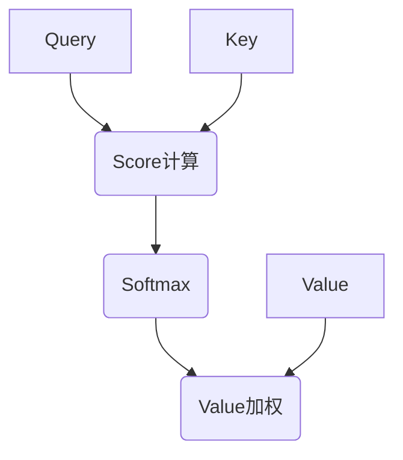

# 神经网络梯度计算机制全解析：从全连接到注意力层

本文从自动微分视角系统解析全连接层与注意力层的梯度计算机制，深入探讨实现细节中的关键问题，并通过代码实例展示PyTorch自动微分的最佳实践。

---

## 一、梯度计算基础架构

### 1.1 自动微分核心要素
```python
class CustomFunction(torch.autograd.Function):
    @staticmethod
    def forward(ctx, *inputs):
        # 前向计算与中间变量保存
        ctx.save_for_backward(...)
        return outputs
    
    @staticmethod
    def backward(ctx, grad_outputs):
        # 基于中间变量计算梯度
        return grad_inputs
```

---

## 二、全连接层实现详解

### 2.1 前向传播数学描述
$$
\mathbf{Y} = \mathbf{X}\mathbf{W} + \mathbf{b} \quad \text{where} \quad
\begin{cases}
\mathbf{X} \in \mathbb{R}^{B \times D_{in}} \\
\mathbf{W} \in \mathbb{R}^{D_{in} \times D_{out}} \\
\mathbf{b} \in \mathbb{R}^{D_{out}}
\end{cases}
$$

### 2.2 梯度保存机制
```python
class LinearFunction(torch.autograd.Function):
    @staticmethod
    def forward(ctx, X, W, b):
        ctx.save_for_backward(X, W, b)  # 存储计算图节点
        return X @ W + b
```

| 存储变量 | 梯度计算用途                 | 维度变化                  |
| -------- | ---------------------------- | ------------------------- |
| X        | 计算 $\partial L/\partial W$ | (B, D_in) → (D_in, D_out) |
| W        | 计算 $\partial L/\partial X$ | (D_in, D_out) → (B, D_in) |
| b        | 计算 $\partial L/\partial b$ | (D_out,) → 求和降维       |

### 2.3 反向传播实现
```python
@staticmethod
def backward(ctx, grad_output):
    X, W, b = ctx.saved_tensors
    return (
        grad_output @ W.T,        # dL/dX
        X.T @ grad_output,         # dL/dW 
        grad_output.sum(dim=0),   # dL/db
        None                      # Placeholder
    )
```

---

## 三、注意力层深度剖析

### 3.1 计算流程分解


### 3.2 梯度保存策略
```python
class AttentionFunction(torch.autograd.Function):
    @staticmethod
    def forward(ctx, Q, K, V):
        scores = Q @ K.transpose(-1, -2) / sqrt(d_k)
        attn = torch.softmax(scores, dim=-1)
        output = attn @ V
        ctx.save_for_backward(Q, K, V, attn)  # 保存四维张量
        return output
```

### 3.3 反向传播关键步骤

#### 梯度计算流程
1. Value梯度计算
   ```python
   grad_V = attn.transpose(-1, -2) @ grad_output
   ```
   
2. 注意力权重梯度
   ```python
   grad_attn = grad_output @ V.transpose(-1, -2)
   ```

3. Score梯度计算（含Softmax梯度）
   ```python
   grad_scores = attn * (grad_attn - (attn * grad_attn).sum(dim=-1, keepdim=True))
   ```

4. Query/Key梯度计算
   ```python
   grad_Q = (grad_scores @ K) / sqrt(d_k)
   grad_K = (grad_scores.transpose(-1, -2) @ Q) / sqrt(d_k)
   ```

---

## 四、实现策略对比分析

### 4.1 存储需求矩阵
| 层类型   | 核心张量                   | 内存瓶颈          | 优化策略        |
| -------- | -------------------------- | ----------------- | --------------- |
| 全连接层 | X (B×D_in), W (D_in×D_out) | 批量维度B         | 梯度检查点      |
| 注意力层 | attn (B×H×L×L)             | 序列长度L的平方项 | Flash Attention |

### 4.2 计算复杂度对比
```python
# 全连接层前向计算
flops = 2 * B * D_in * D_out  # MACs

# 注意力层前向计算
flops = 2 * B * H * L^2 * d_k + 3 * B * H * L * d_k
```

---

## 五、核心实现问题解析

### 5.1 中间变量保存策略

#### 标准操作实现（自动缓存）
```python
class StandardAttention(nn.Module):
    def forward(self, Q, K, V):
        scores = Q @ K.mT / sqrt(d_k)  # 自动记录计算图
        return scores.softmax(-1) @ V  # 无需手动保存
```

#### 自定义Function实现（强制显式保存）
```python
class CustomAttentionFunction(torch.autograd.Function):
    @staticmethod
    def forward(ctx, Q, K, V):
        # 必须显式保存中间结果
        ctx.save_for_backward(Q, K, V, attn)  
        return output
```

### 5.2 梯度验证工具
```python
from torch.autograd import gradcheck

# 数值梯度校验
Q = torch.randn(2, 3, 64, requires_grad=True)
test = gradcheck(CustomAttention.apply, (Q, K, V), eps=1e-6)
print(f"Gradient check passed: {test}")
```

---

## 六、最佳工程实践

### 6.1 内存优化策略
| 技术手段     | 适用场景     | 收益效果           |
| ------------ | ------------ | ------------------ |
| 混合精度训练 | 显存不足     | 减少50%显存占用    |
| 梯度检查点   | 超长序列处理 | 用30%计算换75%内存 |
| 张量分解     | 大权重矩阵   | 降低存储维度       |

### 6.2 计算优化技巧
```python
# 全连接层优化
torch._C._set_mm_strategy('tuned')  # 启用调优矩阵乘

# 注意力层优化
from xformers.ops import memory_efficient_attention
output = memory_efficient_attention(Q, K, V)
```

---

## 七、常见问题排查指南

| 错误类型                             | 检查要点                                        | 解决方案                  |
| ------------------------------------ | ----------------------------------------------- | ------------------------- |
| RuntimeError: saved_tensors mismatch | 1. 前向传播保存变量数量 <br>2. backward读取顺序 | 检查save_for_backward调用 |
| Gradient becomes NaN                 | 1. 输入归一化 <br>2. 梯度裁剪                   | 添加grad_clip模块         |
| CUDA out of memory                   | 1. 注意力矩阵分块 <br>2. 激活检查点             | 使用内存优化策略          |

---

## 八、核心结论

1. **梯度计算本质**：通过链式法则实现张量梯度的高效分配
2. **实现方式选择**：
   - 优先使用标准操作组合（自动微分）
   - 仅在需要特殊优化时自定义Function
3. **性能平衡关键**：
   - 全连接层：优化矩阵乘实现
   - 注意力层：突破O(L²)内存瓶颈
4. **验证必要性**：使用gradcheck确保梯度计算正确性

通过深入理解梯度计算机制，开发者可以针对不同场景选择最优实现方案，在模型效果与计算效率之间取得最佳平衡。
```